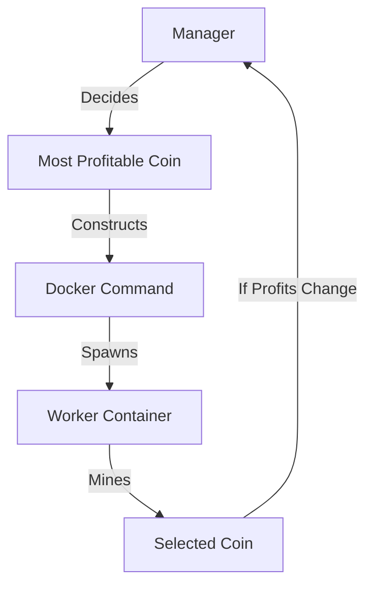

# ⛏️ SmartMiner Worker

> The execution unit of the SmartMiner ecosystem. This is a lightweight, optimized Docker container running XMRig, designed to be dynamically controlled by the Manager.

---

## ⚡ Features

### 🚀 XMRig Core
- Built on the latest version of the high-performance RandomX miner

### 🔄 Ephemeral Design
- Stateless container designed to be killed and respawned instantly with new coin configurations

### ⚙️ Hardware Access
- Configured for direct access to CPU MSR registers (Model Specific Registers)
- Optimized for maximum hashrate

### 🏗️ Low Overhead
- Minimal base image
- System resources dedicated to mining
- No unnecessary background processes

---

## ⚙️ How It Works

Unlike traditional miners where you edit a `config.json` manually, the SmartMiner Worker is fully automated:



1. The Manager analyzes market conditions
2. Determines the most profitable coin
3. Constructs and executes the Docker command
4. Worker container starts with optimized settings
5. Continuous monitoring for optimal performance

---

## Host Optimization (Crucial!)

For maximum hashrate on RandomX (Monero/Zephyr), prepare your Host OS:

#### Enable HugePages
```bash
# Check current HugePages
cat /proc/meminfo | grep Huge

# Set HugePages (adjust count based on your system)
echo "vm.nr_hugepages=1280" | sudo tee -a /etc/sysctl.conf
sudo sysctl -p
```

#### MSR (Model Specific Registers)
The worker container runs with `--privileged` mode, allowing XMRig to automatically apply MSR optimizations.

> No manual host action required for MSR when using the provided Docker setup

---

## 🔧 Troubleshooting

### Low Hashrate Issues
- **Symptom**: Lower than expected hashrate
- **Solution**: 
  - Ensure container runs with `--privileged`
  - Verify HugePages allocation
  - Check CPU affinity settings

### HugePages Allocation
- **Error**: "Failed to allocate HugePages"
- **Solution**:
  - Reboot system
  - Close memory-intensive applications
  - Reduce HugePages count if necessary

### Permission Issues
- **Error**: "Permission denied" for MSR access
- **Solution**:
  - Run container with `--privileged`
  - Ensure Docker has necessary permissions

---

<div align="center">
  <p>⚡ Powered by SmartMiner ⛏️</p>
</div>